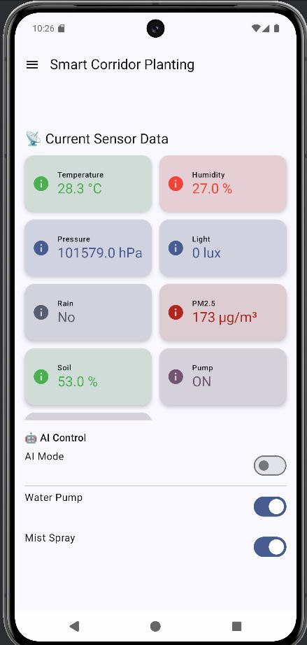

# Open Source Student Project
## Các phần mềm yêu cầu
### Phần mềm
- Arduino IDE
- Python 3.9
- Visual Studio Code
- Solidworks
- MobaXterm (Options)
### Phần cứng
- Các loại sensors
- Sản phẩm in 3D 
- Esp32
- Esp8266
### Cloud
- AWS EC2
### Webserver
- Apache2
### App
- Kotlin language
## Giới thiệu
Đây là một dự án mã nguồn mở được thực hiện bởi nhóm sinh viên với mục tiêu học tập, nghiên cứu và chia sẻ kiến thức.  
Project được phát triển nhằm phục vụ cho việc thực hành kỹ thuật, lập trình và triển khai hệ thống trong môi trường thực tế.

Chúng tôi khuyến khích mọi người sử dụng, chỉnh sửa và đóng góp cho dự án theo đúng tinh thần mã nguồn mở.

---

## 👥 Thành viên nhóm
- **Nguyễn Ngọc Trung [(EryndorTN)](https://github.com/ErinTN2025)**
- **Nguyễn Thế Anh [(TheAnh)](https://github.com/nguyentheanh872004)**
- **Phạm Văn Tài [(PhamTai)](https://github.com/TadashiVN)**
- **Lương Xuân Ngọc [(XuanNgoc)](https://github.com/Ngoc411)**

---

##  Nội dung dự án
Dự án này trình bày quá trình thiết kế và triển khai Hệ thống Ban công Trồng cây Thông minh dựa trên các công nghệ Internet of Things (IoT) và Trí tuệ Nhân tạo (AI). Hệ thống sử dụng các vi điều khiển ESP8266 và ESP32 để thu thập dữ liệu từ nhiều cảm biến môi trường khác nhau, bao gồm cảm biến độ ẩm đất, tổng chất rắn hòa tan trong nước (TDS), bụi mịn PM2.5, nhiệt độ, áp suất và cường độ ánh sáng.

Để tự động điều chỉnh quá trình tưới tiêu và duy trì độ ẩm không khí phù hợp cho cây trồng, hệ thống tích hợp bộ phun sương siêu âm hoạt động ở tần số 20 kHz. Các dữ liệu cảm biến sau khi được thu thập sẽ được truyền lên nền tảng điện toán đám mây, cho phép người dùng theo dõi và giám sát trạng thái ban công theo thời gian thực thông qua ứng dụng web và di động.

Bên cạnh đó, hệ thống còn tích hợp mô-đun AI nhằm dự đoán xác suất mưa trong ngắn hạn và đưa ra quyết định có cần bơm nước vào bể chứa tưới tiêu hay không, từ đó tối ưu hóa việc sử dụng nước và nâng cao hiệu quả quản lý tài nguyên. Kết quả thực nghiệm cho thấy hệ thống có khả năng duy trì môi trường sinh trưởng ổn định cho cây trồng, đồng thời giảm đáng kể sự can thiệp thủ công của con người, phù hợp với xu hướng đô thị thông minh và nông nghiệp đô thị hiện đại.

## Kết quả sản phẩm
### Web

### App

## Bản quyền & Giấy phép

Copyright (c) 2025  
**Nguyễn Ngọc Trung**,**Nguyễn Thế Anh, Phạm Văn Tài, Lương Xuân Ngọc**

Dự án này được phát hành theo **MIT License**.

Bạn được phép:
-  Sử dụng cho mục đích cá nhân và thương mại
- Sao chép, chỉnh sửa, phân phối lại
-  Tích hợp vào các dự án khác

Điều kiện:
-  Phải giữ lại thông báo bản quyền và giấy phép gốc

Xem chi tiết tại file [LICENSE](LICENSE).

---

##  Đóng góp
Mọi đóng góp đều được hoan nghênh:
- Fork repository
- Tạo branch mới
- Gửi Pull Request
- Báo lỗi hoặc đề xuất tính năng mới

---

##  Liên hệ
Nếu có thắc mắc hoặc cần trao đổi thêm, vui lòng tạo **Issue** trong repository.

---

 Nếu bạn thấy project này hữu ích, hãy cho chúng tôi một **Star** để ủng hộ tinh thần sinh viên nhé!
